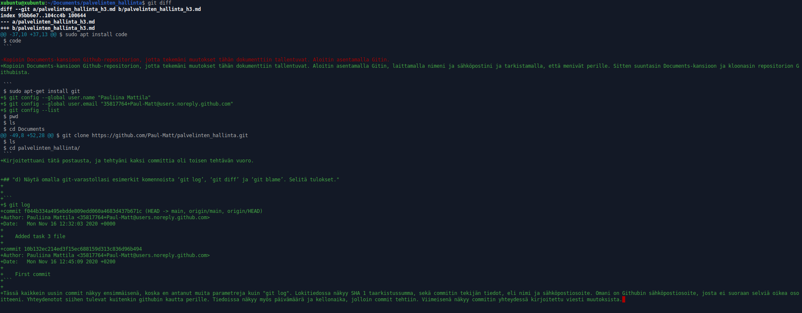
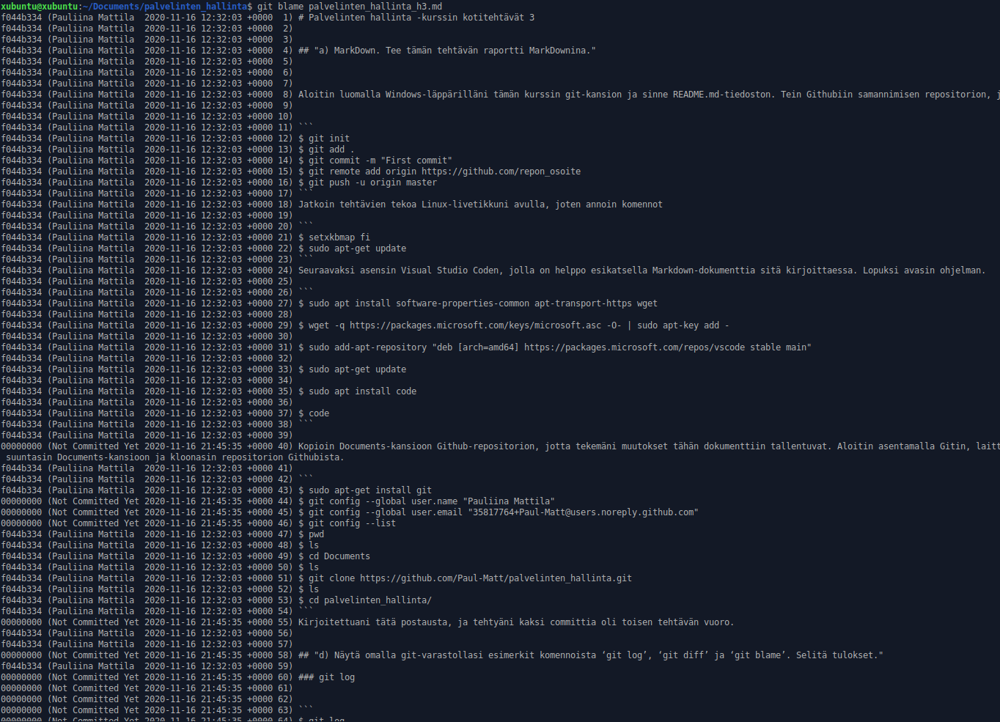
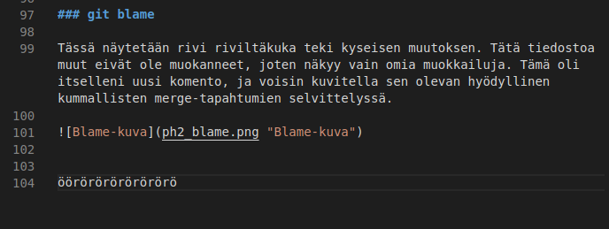
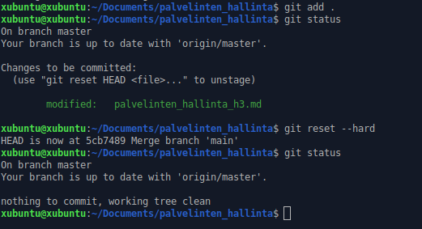
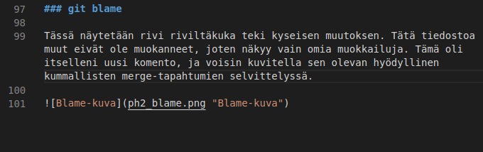
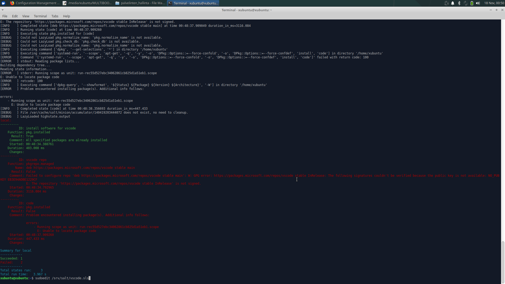
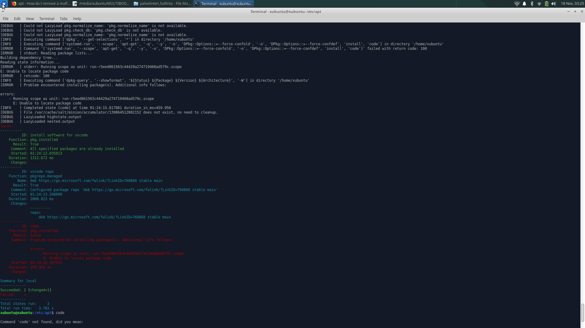

# Palvelinten hallinta -kurssin kotitehtävät 3


## "a) MarkDown. Tee tämän tehtävän raportti MarkDownina."


Aloitin luomalla Windows-läppärilläni tämän kurssin git-kansion ja sinne README.md-tiedoston. Tein Githubiin samannimisen repositorion, ja toin tiedostot sinne avaamalla kansioon Git Bashin, antamalla komennot 


```
$ git init
$ git add .
$ git commit -m "First commit"
$ git remote add origin https://github.com/repon_osoite
$ git push -u origin master
```
Jatkoin tehtävien tekoa Linux-livetikkuni avulla, joten annoin komennot

```
$ setxkbmap fi
$ sudo apt-get update
```
Seuraavaksi asensin Visual Studio Coden, jolla on helppo esikatsella Markdown-dokumenttia sitä kirjoittaessa. Katsoin ohjeet [tältä](https://linuxize.com/post/how-to-install-visual-studio-code-on-ubuntu-18-04/) nettisivulta. Lopuksi avasin ohjelman.

```
$ sudo apt install software-properties-common apt-transport-https wget

$ wget -q https://packages.microsoft.com/keys/microsoft.asc -O- | sudo apt-key add -

$ sudo add-apt-repository "deb [arch=amd64] https://packages.microsoft.com/repos/vscode stable main"

$ sudo apt-get update

$ sudo apt install code

$ code
```

Kopioin Documents-kansioon Github-repositorion, jotta tekemäni muutokset tähän dokumenttiin tallentuvat. Aloitin asentamalla Gitin, laittamalla nimeni ja sähköpostini ja tarkistamalla, että menivät perille. Sitten suuntasin Documents-kansioon ja kloonasin repositorion Githubista.

```
$ sudo apt-get install git
$ git config --global user.name "Pauliina Mattila"
$ git config --global user.email "35817764+Paul-Matt@users.noreply.github.com"
$ git config --list
$ pwd
$ ls
$ cd Documents
$ ls
$ git clone https://github.com/Paul-Matt/palvelinten_hallinta.git
$ ls
$ cd palvelinten_hallinta/
```
Kirjoitettuani tätä postausta, ja tehtyäni kaksi committia oli toisen tehtävän vuoro.


## "d) Näytä omalla git-varastollasi esimerkit komennoista ‘git log’, ‘git diff’ ja ‘git blame’. Selitä tulokset."

### git log


```
$ git log
commit f044b334a495ebdde809edd060a4683d437b671c (HEAD -> main, origin/main, origin/HEAD)
Author: Pauliina Mattila <35817764+Paul-Matt@users.noreply.github.com>
Date:   Mon Nov 16 12:32:03 2020 +0000

    Added task 3 file

commit 10b132ec214ed3f15ec688159d313c836d96b494
Author: Pauliina Mattila <35817764+Paul-Matt@users.noreply.github.com>
Date:   Mon Nov 16 12:45:09 2020 +0200

    First commit
```

Tässä kaikkein uusin commit näkyy ensimmäisenä, koska en antanut muita parametreja kuin "git log". Lokitiedossa näkyy SHA 1 taarkistussumma, sekä commitin tekijän tiedot, eli nimi ja sähköpostiosoite. Omani on Githubin sähköpostiosoite, josta ei suoraan selviä oikea osoitteeni. Yhteydenotot siihen tulevat kuitenkin githubin kautta perille. Tiedoissa näkyy myös päivämäärä ja kellonaika, jolloin commit tehtiin. Viimeisenä näkyy commitin yhteydessä kirjoitettu viesti muutoksista. 


### git log


```
diff --git a/palvelinten_hallinta_h3.md b/palvelinten_hallinta_h3.md
index 95bb6e7..104cc4b 100644
--- a/palvelinten_hallinta_h3.md
+++ b/palvelinten_hallinta_h3.md
```

Tässä näkyy mitä tiedostoja vertaillaan, ja kerrotaan kumpi näkyy tulosteessa --- etumerkeillä ja kumpi +++ etumerkeillä. Eli näytetään mitä on lisätty, mitä poistettu. Loput tekstistä on myös plus- ja miinusmerkkien lisäksi väritetty, joten on helppoa nähdä lisäykset ja poistot. Lisäksi tässä näkyy tarkastussummien lyhennetyt muodot.




### git blame

Tässä näytetään rivi riviltä kuka teki kyseisen muutoksen. Tätä tiedostoa muut eivät ole muokanneet, joten näkyy vain omia muokkailuja. Tämä oli itselleni uusi komento, ja voisin kuvitella sen olevan hyödyllinen kummallisten merge-tapahtumien selvittelyssä.




## "e) Tee tyhmä muutos gittiin, älä tee commit:tia. Tuhoa huonot muutokset ‘git reset –hard’. Huomaa, että tässä toiminnossa ei ole peruutusnappia."


Tein tiedoston loppuun pienen "typon" riville 104. 




Lisäsin muutoksen seurantaan, mutta ennen committia tein hard resetin.




Tarkistin vielä, että tiedostosta oli hävinnyt muutokset. Rivi 104 on tyhjä, kuten pitääkin.





## "f) Tee uusi salt-moduli. Voit asentaa ja konfiguroida minkä vain uuden ohjelman: demonin, työpöytäohjelman tai komentokehotteesta toimivan ohjelman. Käytä tarvittaessa ‘find -printf “%T+ %p\n”|sort’ löytääksesi uudet asetustiedostot. (Tietysti eri ohjelma kuin aiemmissa tehtävissä, tarkoitushan on harjoitella Salttia)"

Halusin kokeilla jotain haastavampaa ja tutustua Saltin dokumentteihin. Mietin, olisiko mahdollista kokeilla yllä mainittua Visual Studio Coden asennusta Saltilla. Tutkin Saltin dokumentaatiota, ja yritin ottaa tarkemmin selvää, mitä kussakin kohdassa asennusta tapahtuu.

Käytin tätä [nettisivua](https://linuxize.com/post/how-to-add-apt-repository-in-ubuntu/) ymmärtääkseni apt repositorion lisäämisen osasia enemmän. Saltin dokumenteista tutkin erityisesti Saltin moduulien asennuksesta kertovaa [osiota](https://docs.saltstack.com/en/latest/ref/states/all/salt.states.pkg.html#module-salt.states.pkg).

Rakensin vscode.init-dokumentin, jota kokeilin ensin Salt minionilla. Kone meni jotenkin kierroksille ja kesti todella pitkään. Päätin keskeyttää. Luulin, että koneen kierroksille menoa kannattaisin tutkia, joten ajoin tilaa paikallisesti debug-moodissa. Sain seuraavanlaisen virheviestin: 



Laitoin livetikun uudestaan pyörimään, ja muokkasin osoitetta, josta deb-paketti haetaan. löydettyäni [täältä](https://code.visualstudio.com/docs/setup/linux) vaihtoehdon. Muokkasin myös sls-tiedoston seuraavanlaiseksi:

```
  GNU nano 2.9.3                                                                                                             /var/tmp/vscodeXXz2V3it.sls                                                                                                                       

install software for vscode:
  pkg.installed:
    - pkgs:
      - software-properties-common
      - apt-transport-https

vscode repo:
  pkgrepo.managed:
    - name: deb https://go.microsoft.com/fwlink/?LinkID=760868 stable main

code:
  pkg.installed

```

Pääsin hieman eteenpäin, mutta sain uuden virheviestin:



Täytyy myöntää tappio, ja yrittää jatkaa tätä myöhemmin, josko vielä tämän viimeisen askeleen saisin menemään läpi, ja ohjelman etäasennettua.

Lähteet:
Tehtävät: [Palvelinten hallinta -kurssisivu](http://terokarvinen.com/2020/configuration-management-systems-palvelinten-hallinta-ict4tn022-autumn-2020/)